Welcome Anastasiya McAvoy,

## Code Institute - Milestone project 1: User-Centric Frontend Development
## DAILY WORD

### About

I built this game because I genuinely love playing WORDLE, and I wanted to create a version that I’d actually enjoy and use myself. It’s been a fantastic choice; building something I care about has kept me motivated to improve it with every tweak. What you're playing now is the MVP, but it’s just the beginning. I already have friends and family playing daily, and that only fuels my excitement to keep evolving the game and making it even better.

This simple, addictive daily word game gives you six chances to guess the word of the day, which changes every 24 hours. When you submit a guess, it’s checked in real-time using a word validation API to ensure it’s a valid word (because fairness is key to keeping the game fun). You’ll get instant feedback through friendly pop-ups—whether your word is too short, not valid, or you've cracked the code. Each guess also highlights the correct letters and placements to guide your next move.

Designed to keep you coming back every day, the game challenges your vocabulary while sharpening your skills. What you're experiencing now is a clean, focused MVP, but there's plenty more to come. I’ve got big plans for adding enhanced features to keep the game fresh and engaging. Check out the Design and Planning section for a sneak peek at what’s next!

View live website [HERE](https://anastasiya-m4c.github.io/Wordle/)

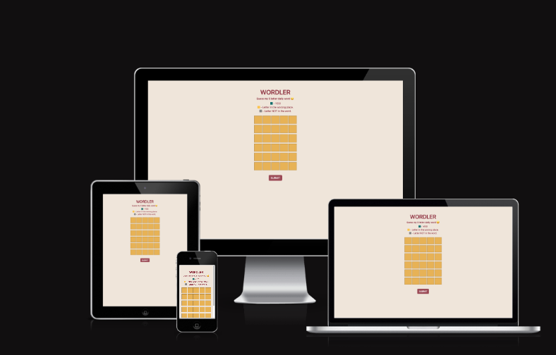

## Table Of Contents:

1. [Design & Planning](#design-&-planning)

   - [User Stories](#user-stories)
   - [Wireframes](#wireframes)
   - [Typography](#typography)
   - [Colour Scheme](#colour-scheme)

2. [Features](#features)

   - [In Game Functions](#in-game-functions)

3. [Technologies Used](#technologies-used)
4. [Testing](#testing)
5. [Bugs](#bugs)
6. [Deployment](#deployment)
7. [Credits](#credits)

## Design & Planning:

### User Stories

### 1. User Story: Guess the word

**As a user,**  
I want to enter a five-letter word,
**So that I can**
try to guess the daily puzzle.

### 2. User Story: User feedback

**As a user,**  
I want feedback on each letter after a guess,  
**So that I can** see which letters are correct, incorrect, or misplaced.

### 3. User Story: Game limits

**As a user,**  
I want to have only six attempts
**So that the game** remains challenging and fair.

### 4. User Story: Dynamic messaging

**As a user,**  
I want to be notified when I guess the correct word
**So that I can** celebrate my win.

### 5. User Story: Auto refresh

**As a user,**  
I want the puzzle to reset each day with a new word
**So that i can** play daily and stay engaged.

### 6. User Story: User feedback

**As a user,**  
I want to receive in the moment feedback when the word is not valid or not long enough
**So that I can** correct my mistake and continue playing.

### Future developments

**On-Screen Keyboard Integration**  
_Objective:_ Enhance accessibility and user experience by providing an interactive on-screen keyboard.  
_User Story:_ As a player, I want access to an on-screen keyboard that reflects the current state of the game (e.g., used, correct, incorrect letters), so that I can more easily input guesses—especially on mobile or touch-screen devices.

**Welcome Modal & Onboarding Experience**  
_Objective:_ Introduce new players to the game with a brief, intuitive onboarding flow that outlines the basic rules and mechanics.  
_User Story:_ As a first-time player, I want to see a welcome modal with a brief explanation of the game, so that I can understand how to play and feel confident before making my first guess.

**Engaging features**  
_Objective:_ Introduced a timer that starts when users enters 1st guess.  
_User Story:_ I want to see a how long it takes me to guess the daily word so that i can try and beat my time from the previous day.

**Dictionary API**  
_Objective:_ Expand the array of daily words, so that user can keep on playing.  
_User Story:_ As a player, I want to keep returning to play the game with little change that secret word will repeat.

**AAA WCAG Accessibility Standards**  
_Objective:_ Address any outstanding accessibility warnings to achieve AAA standard.  
_User Story:_ I want this game to be fully accessible with best practices followed so that it's fully compatible with assistive technologies.

### Wireframes

This game is designed to be simple, clean, and distraction-free, featuring a 5x6 grid and straightforward messaging so players can focus purely on the challenge of winning. Friendly, real-time modal feedback helps guide the experience, while the letter highlighting system supports strategic thinking—making it easy for players to plan their next move with confidence.

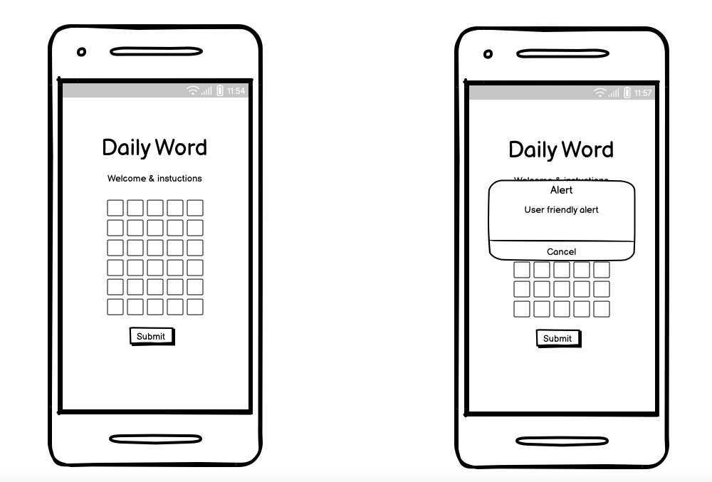  
  
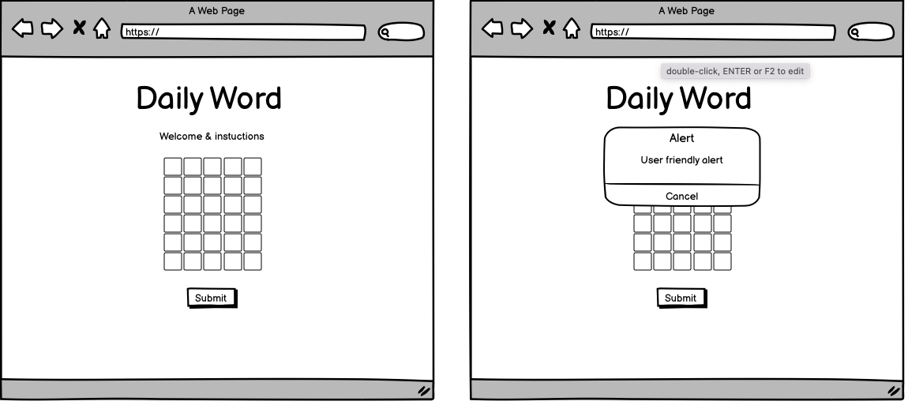

Final MVP version:  
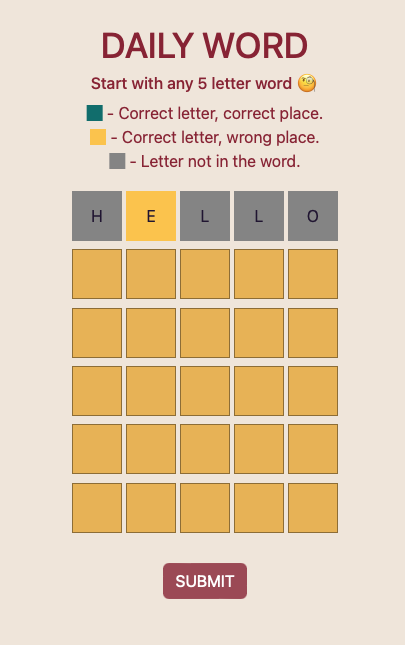  
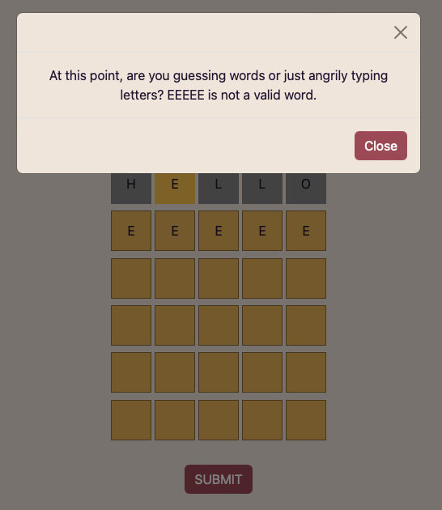  
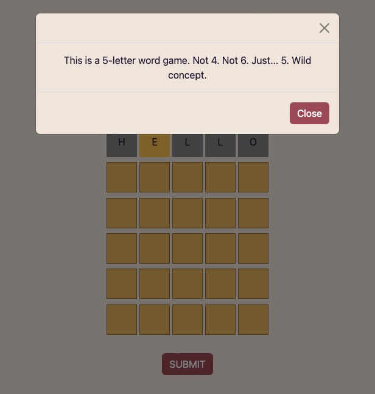
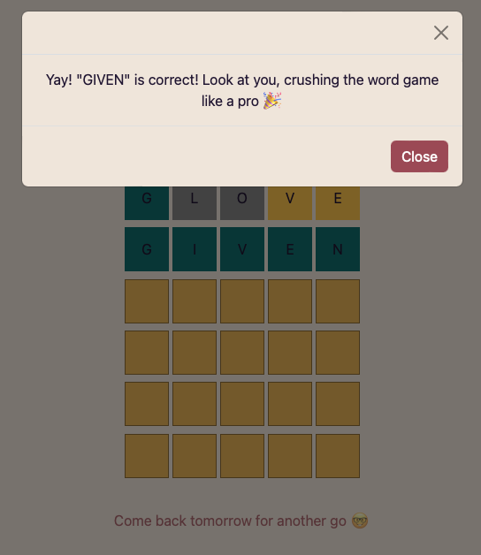  
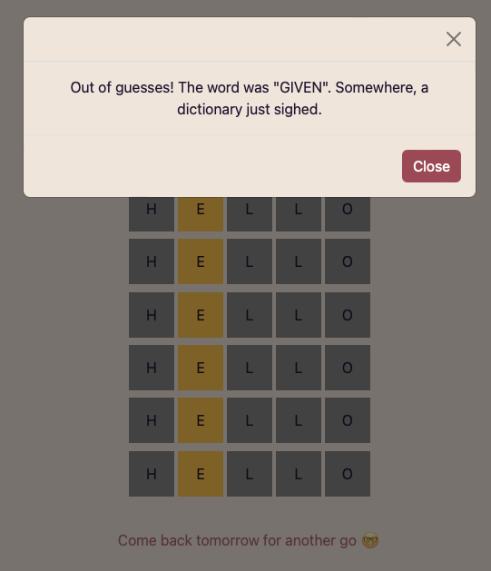  

### Typography

The font was intentionally selected to align with the visual style of the popular word game Wordle, so that it's instantly recognized and familiar to players. It’s also clean, ensuring there are no distractions for the thinkers.

Because this game is designed to keep players coming back each day, the win/loss messages rotate regularly to keep things fresh. And since no one wants a boring experience, these messages come with a bit of attitude and humor—just enough to keep things light, cheeky, full of emojis and entertaining, whether you win or lose.

## Features:

This is a browser-based, daily 5-letter word guessing game that challenges players to crack a new word puzzle every day. Inspired by the mechanics of popular word game, players have six attempts to guess the secret word of the day. Each guess provides color-coded feedback, guiding players closer to the answer while testing their vocabulary and deduction skills.

### In game functions

- Daily Word Logic
  A different word is chosen every day using the current date.
  An array of predefined 5-letter words cycle throughout the year.
- Game Grid
  A 6-row by 5-column input grid where players enter their guesses.
  Each input is limited to a single character to mimic real letter placement.
- Guess Validation
  Words must be real English words (validated using a dictionary API).
  Invalid entries trigger a humorous modal message.
- Color-Coded Feedback
  Green: Correct letter in the correct position.
  Yellow: Correct letter, wrong position.
  Gray: Letter not in the word at all.
- Dynamic Messaging
  Custom congratulatory or fail messages based on game outcome.
  Adds a touch of humor and personality to each session.
- Keyboard Interaction
  Supports full keyboard controls:
  Type letters to fill tiles.
  Enter to submit.
  Backspace to delete.
- Game State Handling
  Once the correct word is guessed or attempts run out, inputs and the submit button are disabled to prevent further interaction.
- Responsive Input Behavior
  Auto-focus starts on the first tile on load and shifts across input boxes as you type or delete letters.
  Only the current row is editable, preserving game progression.
- User Experience Touches
  Bootstrap modal integration for feedback.
  Clear accessibility consideration with aria-labels for tiles.
  Automatically highlights the correct word or end-of-game result.

### Languages Used

- HTML - To create a basic site structure.
- CSS - To create custom styles.
- JS - To build a fully responsive game.
- Bootstrap - For consistent styling and improved responsiveness.

### Frameworks Libraries and Programmes Used

- Font Awesome - for icons.
- Favicon.io - to create a favicon.
- Colormind.io - to create a colour scheme.
- Google Fonts - for custom font size that fits with the of the industry.
- GitHub - to create board, host repository & deploy site.
- GitPod - to develop project and organise version control.
- Devtools - for debugging and adjusting layouts.
- Lighthouse - for testing especially performance related issues.
- Wave evaluation tool - for any accessibility related issues.
- Chat GPT - for generating site content.
- Voiceover - for acesibility testing.
- axe DevTools - for any accessibility related issues.

## Testing

Throughout the development of this project, I have conducted several rounds of testing to ensure a smooth user experience, robust functionality, and adherence to web standards. The testing covered browser compatibility, accessibility, functionality, real device testing, and UI/UX design which was achieved through a combination of manual testing and use of code validators, tools like Lighthouse & plugins and validators.

_Manual Testing:_ The core features of the game, including word validation, guess input, feedback messages, and modal functionality, have been manually tested to ensure they work as expected. This includes testing edge cases like submitting invalid words, guessing beyond the allowed attempts, and ensuring that the feedback (e.g., color-coded squares) accurately reflects the game state.

_Error Handling:_ I tested the app to make sure that errors (e.g., network issues, invalid input) are gracefully handled. If the game fails to fetch a word or encounters an unexpected issue, it displays a clear error message to the user.

_User Feedback:_ After completing the MVP, I asked friends and family to test the game and provide feedback. This feedback was invaluable in fine-tuning the user experience and has been converting into user stories for future development.

### Google's Lighthouse Performance

- WEB browser  
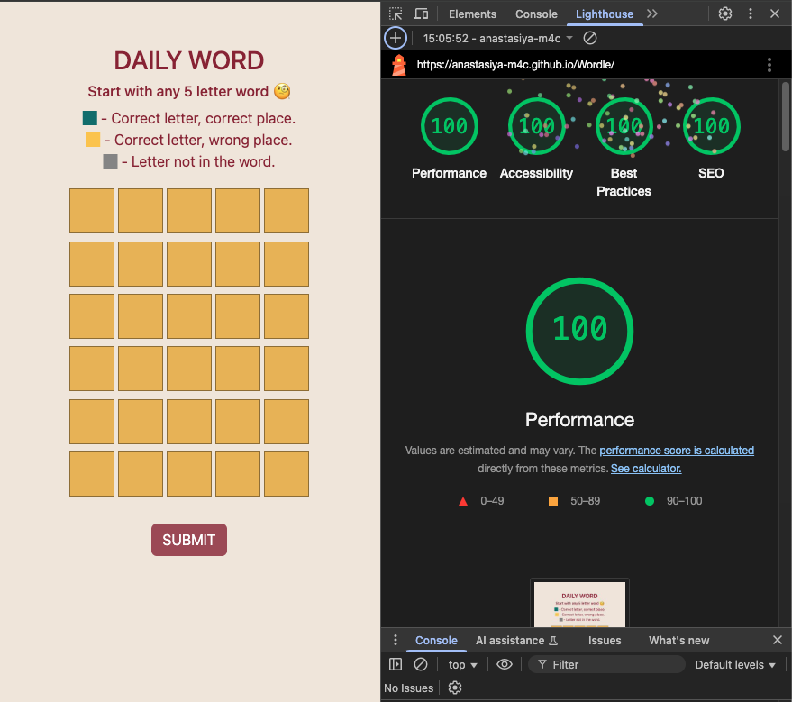  
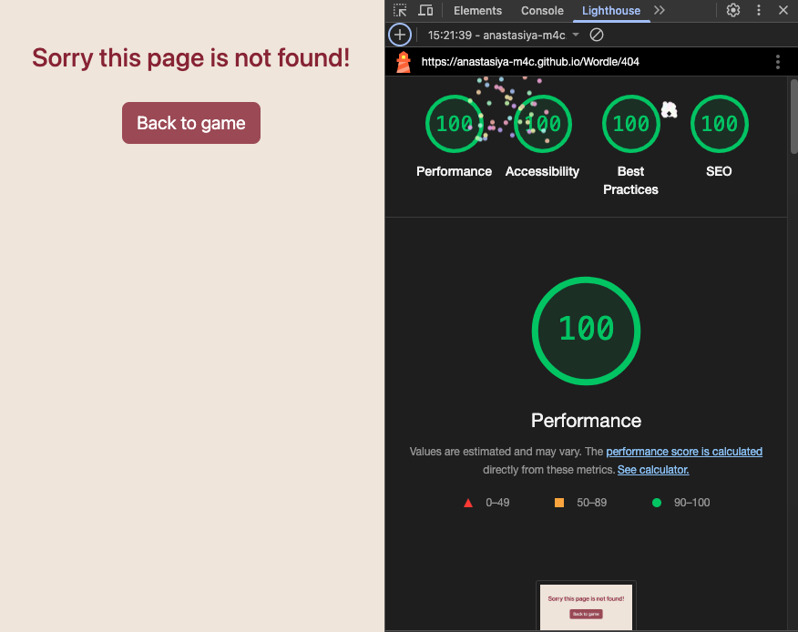  

- Mobile  
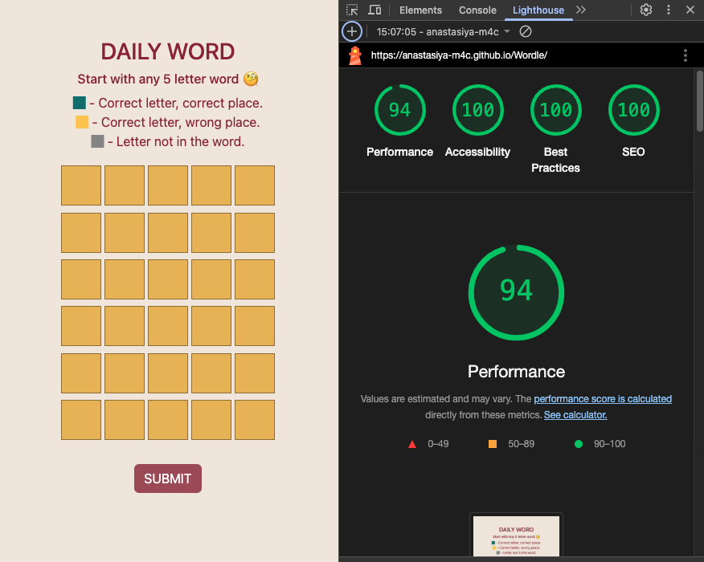   
  

### Browser Compatibility

| Browser tested | Intended appearance | Intended responsiveness |
| -------------- | ------------------- | ----------------------- |
| Chrome         | Good                | Good                    |
| FireFox        | Good                | Good                    |
| Safari         | Good                | Good                    |

### Responsiveness

This is tested on a combination of real life devices and well as responsive viewer in Chrome. Some subtle apperance changes seen due to OS spesification.

- iPhone SE
- iPhone 13
- Serface pro 7
- Nest hub MAX
- Google pixel 8a
- Web Browser

### Code Validation

Validation completed vith no errors.

- CSS    
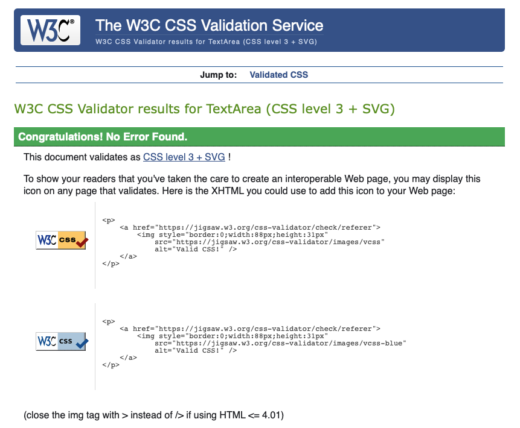
- JSHINT  
linter 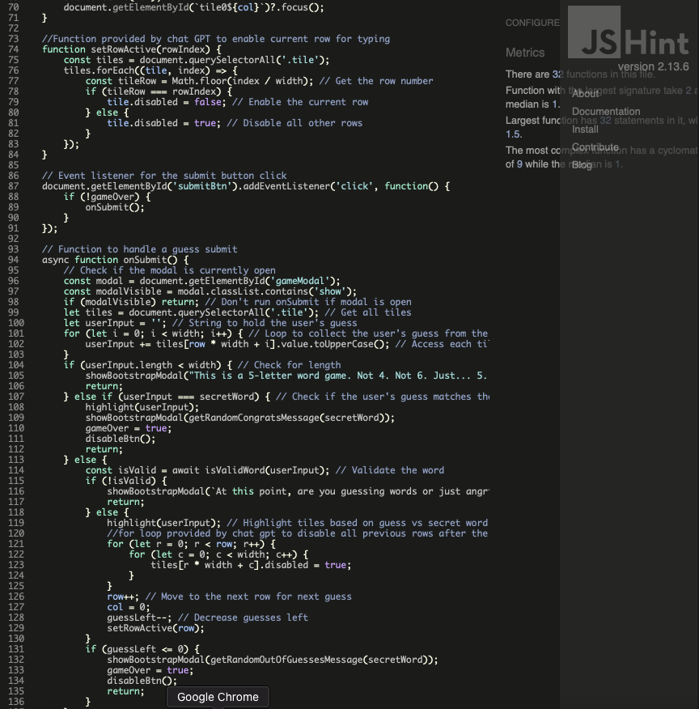
- HTML  
  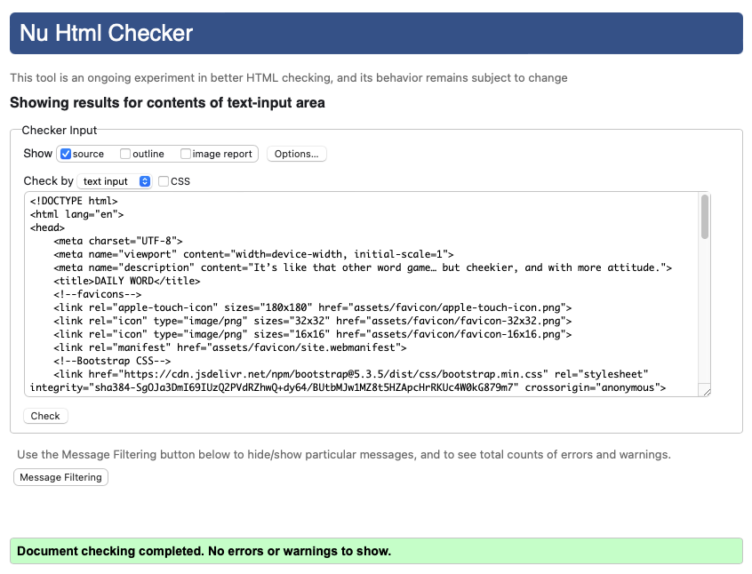
  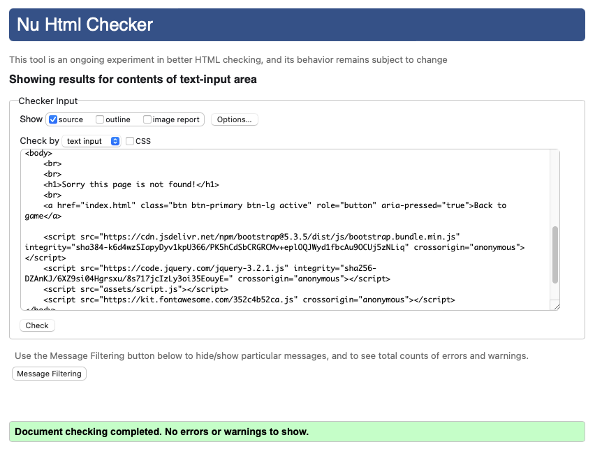

### Manual Testing user stories or/and features

### Accessibility

The colors have been carefully selected to comply with accessibility contrast standards, ensuring readability and visual clarity for all users. To verify these standards, the game has been tested using the WAVE & axe DevTools plugins on Chrome, which checks for any potential accessibility issues. And in accordance to axe DevTools has acheived a WCAG 2.1 AA standard.

Additionally, further manual testing with VoiceOver and using tab navigation has also been performed to ensure that the game is fully usabe for users with impairments or using asistive technologies, further enhancing the user experience for a diverse audience.

This will be further addressed in the future developments to reach full AAA standard.

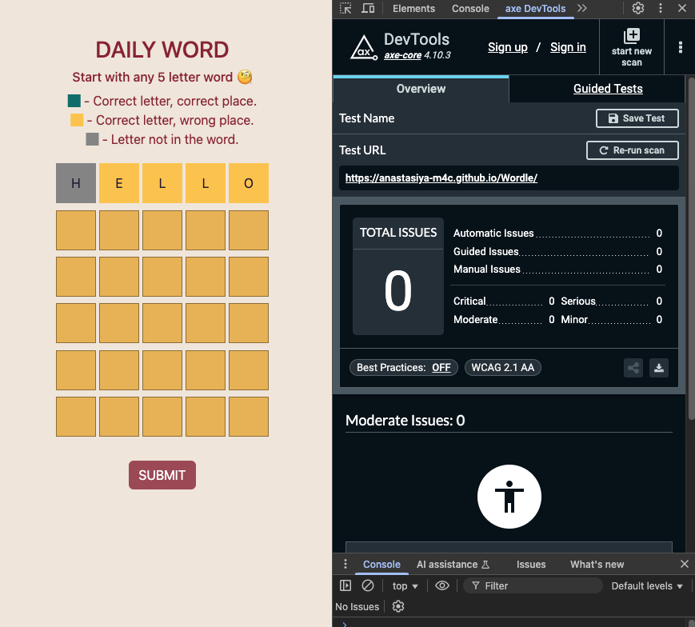
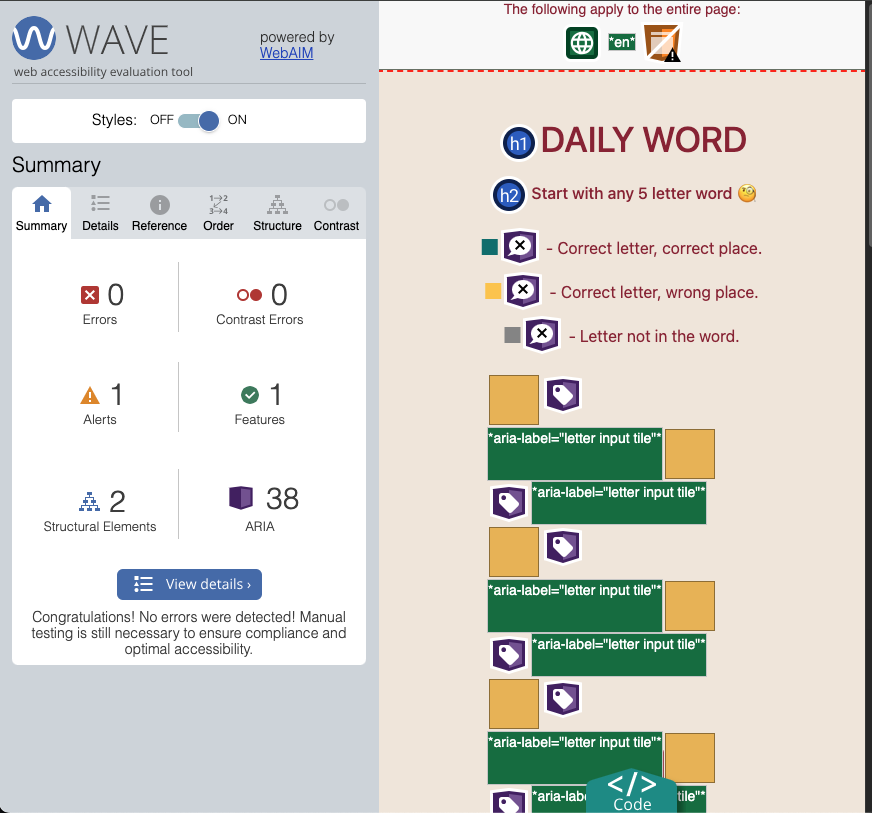
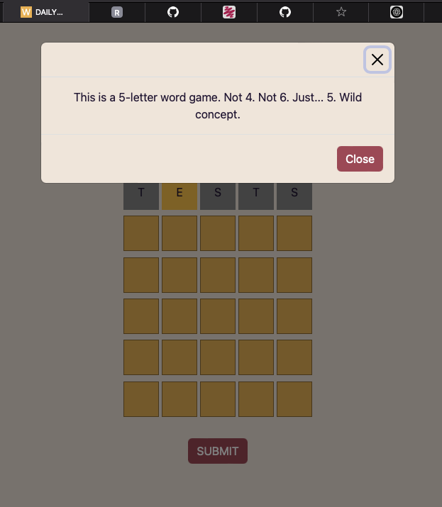
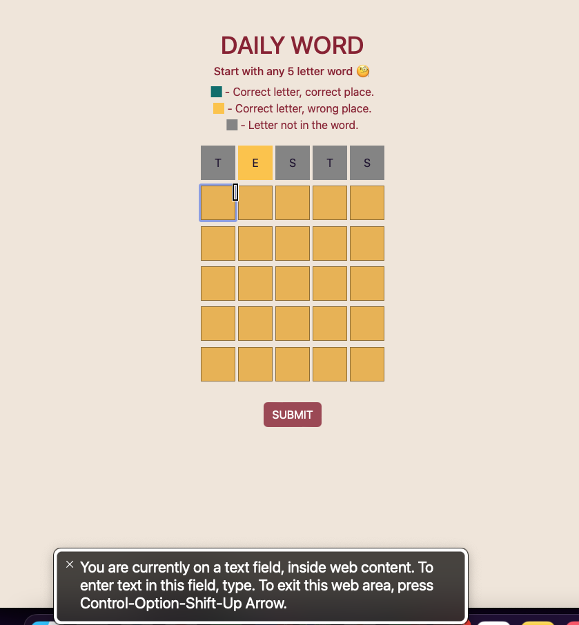

## Bugs

_Issue_: Unidentified error seen in Lighthouse for event listener function.  
_Cause_: JS links were left when copied from the index.html file.  
_Solution_: Removed JS links from the 404 page.  

_Issue_: Primary button color on the 404 page was being overridden by Bootstrap's default.  
_Cause_: Bootstrap's default color.  
_Solution_: Applied a fix by targeting the active-btn class of the button instead of the btn class.  

_Issue_: Modal fading issue, when pressing enter while modal was open the screen grew darker.  
_Cause_: Event listener was active when the modal was open.  
_Solution_: Disabled the event listener when the modal is open.  

_Issue_: Input field preventing tabbing, causing accessibility issues.  
_Cause_: Default browser option.  
_Solution_: Applied a fix to only include letters and not prevent tabbing.  

_Issue_: Input issue – when user typed letter starting form tile 2 onward letter input duplicated from tile 1.  
_Cause_: Code expected user to start typing from the first letter in a sequence instead of inputting letters in random order.  
_Solution_: When user manually selects a tile they are automatically redirected to the first tile to type in sequence.  

_Issue_: Validator feedback: background color set to none.  
_Cause_: Not best practive for css code.  
_Solution_: Fixed based on validator feedback by setting the background color appropriately.  

_Issue_: Secret word was not being rendomly selected.  
_Cause_: Function expected uppercase.  
_Solution_: Changed an array to uppercase words.  

_Issue_: Accessibility labels missing on tiles.  
_Cause_: Aria-label missing form JS grid.  
_Solution_: Added aria-labels to the tiles.  

_Issue_: Submit button enabled when no guesses left.  
_Cause_: As per default code, discovered during UX testing.  
_Solution_: Disabled the submit button if no guesses were left.  

_Issue_: Submit button active after game won/no more guesses.  
_Cause_: As per default code, discovered during UX testing.  
_Solution_: Disabled the submit button after the game has been won and when there are no more guesses left.  

_Issue_: Correct guess not being highlighted if the game has been won.  
_Cause_: As per design, discovered during UX testing.  
_Solution_: Applied a fix to ensure the correct guess is highlighted even if the game has been won.  

_Issue_: Incorrect r & c references.  
_Cause_: Using r and c instead of appropriate column (col) and row (row) references.  
_Solution_: Changed r and c references to the appropriate column and row.  

_Issue_: Bug for the uneditable first row.  
_Cause_: Likely the initial state or logic for enabling/disabling rows was incorrectly applied.  
_Solution_: The setRowActive(row) function, called in initialise() with row = 0, ensures that the first row is enabled upon page load.  

_Issue_: Player could edit previous guesses.
_Cause_: The logic for disabling rows after a guess was submitted was missing.  
_Solution_: A for loop was added within the onSubmit() function to iterate through all tiles in previous rows and disable them.  

_Issue_: Next row not enabled after submit.  
_Cause_: Caused by adding a loop to disable previous raws after the guess was made.  
_Solution_: Applied a fix to enable the next row once the submit function has run.  

_Issue_: onSubmit not working across multiple lines.  
_Cause_: The logic for collecting the user's input from the grid was only considering a single line.  
_Solution_: Changes were made within the onSubmit() function to correctly gather the 5-letter word from the tiles of the current active row.  

_Issue_: initialise was a variable instead of a function.  
_Cause_: A typographical error or incorrect declaration during the initial setup.  
_Solution_: Changed the initialise declaration to function initialise() { ... }.  

_Issue_: User input alert: less than sign incorrect.  
_Cause_: A typographical error in the conditional statement that checks the length of the user's input.  
_Solution_: Corrected the less than operator (<) in the if (userInput.length < width) { ... } condition.  

_Issue_: Typo: tile* instead of tlie in JS file.  
_Cause_: A simple typographical error when referencing the tile class or element.  
_Solution_: Corrected the spelling.  

## Known Issues

- After the modal is closed, an aria-hidden warning appears in the console. This is set by Bootstrap and is expected, as it's used to hide the modal from screen readers while it’s not visible. When the modal is shown, Bootstrap removes aria-hidden or sets it to false. This is a non-issue — no further action is needed.

- A 404 API error is received when the user enters an invalid word. This error is expected, as the invalid word is not found in the dictionary and a 404 is returned by the API. This is intelligently handled within the code to show the user a friendly modal pop-up. The console log is returned directly from the API and is not a result of faulty code. This is a non-issue — no further action is needed.

## Deployment

#### Creating Repository on GitHub

1. First make sure you are signed into [Github](https://github.com/) and go to the code institutes template, which can be found [here](https://github.com/Code-Institute-Org/gitpod-full-template).
2. Then click on **use this template** and select **Create a new repository** from the drop-down. Enter the name for the repository and click **Create repository from template**.
3. Once the repository was created, I clicked the green **gitpod** button to create a workspace in gitpod so that I could write the code for the site.

#### Deploying on Github

The site was deployed to Github Pages using the following method:

1. Go to the Github repository.
2. Navigate to the 'settings' tab.
3. Using the 'select branch' dropdown menu, choose 'main'.
4. Click 'save'.

## Credits

### Special thanks:

**David Bowers** for support and mentoring.  
**Marco** for continuous support and unlimited information and hours of troubleshooting.  
**Kyle** for being my number one motivator and biggest fan.

---
