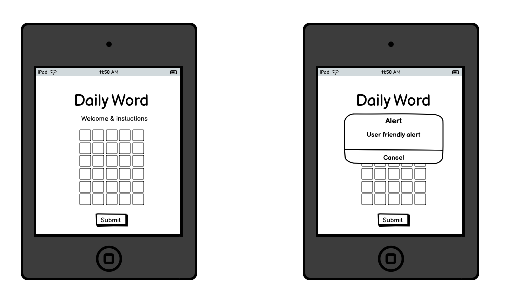

Welcome Anastasiya McAvoy,

## Code Institute - Milestone project 1: User-Centric Frontend Development
## DAILY WORD

### About
I built this game because I genuinely love playing WORDLE, and I wanted to create a version that I’d actually enjoy and use myself. It’s been a fantastic choice; building something I care about has kept me motivated to improve it with every tweak. What you're playing now is the MVP, but it’s just the beginning. I already have friends and family playing daily, and that only fuels my excitement to keep evolving the game and making it even better.

This simple, addictive daily word game gives you six chances to guess the word of the day, which changes every 24 hours. When you submit a guess, it’s checked in real-time using a word validation API to ensure it’s a valid word (because fairness is key to keeping the game fun). You’ll get instant feedback through friendly pop-ups—whether your word is too short, not valid, or you've cracked the code. Each guess also highlights the correct letters and placements to guide your next move.

Designed to keep you coming back every day, the game challenges your vocabulary while sharpening your skills. What you're experiencing now is a clean, focused MVP, but there's plenty more to come. I’ve got big plans for adding enhanced features to keep the game fresh and engaging. Check out the Design and Planning section for a sneak peek at what’s next!

View live website [HERE](https://anastasiya-m4c.github.io/Wordle/)

## Table Of Contents:
1. [Design & Planning](#design-&-planning)
    * [User Stories](#user-stories)
    * [Wireframes](#wireframes)
    * [Typography](#typography)
    * [Colour Scheme](#colour-scheme)

2. [Features](#features)
    * [In Game Functions](#in-game-functions)

3. [Technologies Used](#technologies-used)
4. [Testing](#testing)
5. [Bugs](#bugs)
6. [Deployment](#deployment)
7. [Credits](#credits)

## Design & Planning:  

### User Stories  
### 1. User Story: Guess the word
**As a user,**  
I want to enter a five-letter word,
**So that I can** 
try to guess the daily puzzle.

### 2. User Story: User feedback
**As a user,**  
I want feedback on each letter after a guess,  
**So that I can** see which letters are correct, incorrect, or misplaced.  

### 3. User Story: Game limits
**As a user,**  
I want to have only six attempts
**So that the game** remains challenging and fair. 

### 4. User Story: Dynamic messaging
**As a user,**  
I want to be notified when I guess the correct word
**So that I can** celebrate my win. 

### 5. User Story: Auto refresh
**As a user,**  
I want the puzzle to reset each day with a new word
**So that i can** play daily and stay engaged.

### 6. User Story: User feedback
**As a user,**  
I want to receive in the moment feedback when the word is not valid or not long enough
**So that I can** correct my mistake and continue playing. 

### Future developments
**On-Screen Keyboard Integration**  
*Objective:* Enhance accessibility and user experience by providing an interactive on-screen keyboard.  
*User Story:* As a player, I want access to an on-screen keyboard that reflects the current state of the game (e.g., used, correct, incorrect letters), so that I can more easily input guesses—especially on mobile or touch-screen devices.  

**Welcome Modal & Onboarding Experience**  
*Objective:* Introduce new players to the game with a brief, intuitive onboarding flow that outlines the basic rules and mechanics.  
*User Story:* As a first-time player, I want to see a welcome modal with a brief explanation of the game, so that I can understand how to play and feel confident before making my first guess.  

**Engaging features**   
*Objective:* Introduced a timer that starts when users enters 1st guess.   
*User Story:* I want to see a how long it takes me to guess the daily word so that i can try and beat my score from the previous day.   

**Dictionary API**   
*Objective:* Expand the array of daily words, so that user can keep on playing.  
*User Story:* As a player, I want to keep returning to play the game with little change that secret word will repeat.    

**AAA WCAG Accessibility Standards**   
*Objective:* Address any outstanding accessibility warnings to achieve AAA standard.  
*User Story:* I want this game to be fully accessible with best practices followed so that it's fully compatible with assistive technologies. 

### Wireframes  
This game is designed to be simple, clean, and distraction-free, featuring a 5x6 grid and straightforward messaging so players can focus purely on the challenge of winning. Friendly, real-time modal feedback helps guide the experience, while the letter highlighting system supports strategic thinking—making it easy for players to plan their next move with confidence.

  
  
  

### Typography
The font was intentionally selected to align with the visual style of the popular word game Wordle, so that it's instantly recognized and familiar to players. It’s also clean, ensuring there are no distractions for the thinkers.

Because this game is designed to keep players coming back each day, the win/loss messages rotate regularly to keep things fresh. And since no one wants a boring experience, these messages come with a bit of attitude and humor—just enough to keep things light, cheeky, full of emojis and entertaining, whether you win or lose.

## Features:
This is a browser-based, daily 5-letter word guessing game that challenges players to crack a new word puzzle every day. Inspired by the mechanics of popular word game, players have six attempts to guess the secret word of the day. Each guess provides color-coded feedback, guiding players closer to the answer while testing their vocabulary and deduction skills.

### In game functions 
- Daily Word Logic
A different word is chosen every day using the current date.
An array of predefined 5-letter words cycle throughout the year.
- Game Grid
A 6-row by 5-column input grid where players enter their guesses.
Each input is limited to a single character to mimic real letter placement.
- Guess Validation
Words must be real English words (validated using a dictionary API).
Invalid entries trigger a humorous modal message.
- Color-Coded Feedback
Green: Correct letter in the correct position.
Yellow: Correct letter, wrong position.
Gray: Letter not in the word at all.
- Dynamic Messaging
Custom congratulatory or fail messages based on game outcome.
Adds a touch of humor and personality to each session.
- Keyboard Interaction
Supports full keyboard controls:
Type letters to fill tiles.
Enter to submit.
Backspace to delete.
- Game State Handling
Once the correct word is guessed or attempts run out, inputs and the submit button are disabled to prevent further interaction.
- Responsive Input Behavior
Auto-focus starts on the first tile on load and shifts across input boxes as you type or delete letters.
Only the current row is editable, preserving game progression.
- User Experience Touches
Bootstrap modal integration for feedback.
Clear accessibility consideration with aria-labels for tiles.
Automatically highlights the correct word or end-of-game result.

### Languages Used
- HTML - To create a basic site structure.
- CSS - To create custom styles.
- JS - To build a fully responsive game.
- Bootstrap - For consistent styling and improved responsiveness. 

### Frameworks Libraries and Programmes Used
- Font Awesome - for icons.
- Favicon.io - to create a favicon.
- Colormind.io - to create a colour scheme.
- Google Fonts - for custom font size that fits with the of the industry.
- GitHub - to create board, host repository & deploy site.
- GitPod - to develop project and organise version control.
- Devtools - for debugging and adjusting layouts.
- Lighthouse - for testing especially performance related issues.
- Wave evaluation tool - for any accessibility related issues.
- Chat GPT - for generating site content. 
- Voiceover - for acesibility testing. 
- axe DevTools - for any accessibility related issues.

## Testing
The site has been tested fully by viewing pages and clicking the links manually in a number of different browsers as well as with a use of assisted tools like dev tools and lighthouse, code checker, wave plug in.

### Google's Lighthouse Performance
lighthouse performance has been tested on a chromebook and varies much depending on the device tested on and internet speed. Overall performance passed with no failures and showing green results especially on web some mobile results are in high amber, images have been converted to webp, optimised and resized to minimise any performance issues. Some future adjustments can be made but are outside the scope of this project and are mostly due to the imported code like bootstrap and google fonts.  

Results:

### Browser Compatibility

 Browser tested | Intended appearance | Intended responsiveness |
| --- | --- | --- |
| Chrome | Good | Good |
| FireFox | Good | Good |
| Safari | Good | Good |

### Responsiveness

This is tested on a combination of real life devices and well as responsive viewer in Chrome. Some subtle apperance changes seen due to OS spesification.

- iPhone SE
- iPhone 13   
- Serface pro 7    
- Nest hub MAX   
- Google pixel 6 
- Web Browser

### Code Validation
Validation completed vith no errors.  
- CSS 
- JSHINT linter 
- HTML 

### Manual Testing user stories or/and features

### Accessibility 
The colors have been carefully selected to comply with accessibility contrast standards, ensuring readability and visual clarity for all users. To verify these standards, the game has been tested using the WAVE & axe DevTools plugins on Chrome, which checks for any potential accessibility issues. And in accordance to axe DevTools has acheived a WCAG 2.1 AA standard. 

Additionally, further manual testing with VoiceOver and using tab navigation has also been performed to ensure that the game is fully usabe for users with impairments or using asistive technologies, further enhancing the user experience for a diverse audience.

This will be further addressed in the future developments to reach full AAA standard.

## Bugs  
*Issue*: site.manifest file error in dev tools - failed to load resource: the server responded with a status of 404 ()  
*Cause*: broken file path, needed help of a tutor to understand the error.  
*Solution*: Updated to a relative file path.  

## Known Issues 

- After the modal is closed, an aria-hidden warning appears in the console. This is set by Bootstrap and is expected, as it's used to hide the modal from screen readers while it’s not visible. When the modal is shown, Bootstrap removes aria-hidden or sets it to false. This is a non-issue — no further action is needed.

- A 404 API error is received when the user enters an invalid word. This error is expected, as the invalid word is not found in the dictionary and a 404 is returned by the API. This is intelligently handled within the code to show the user a friendly modal pop-up. The console log is returned directly from the API and is not a result of faulty code. This is a non-issue — no further action is needed.

## Deployment
#### Creating Repository on GitHub
1. First make sure you are signed into [Github](https://github.com/) and go to the code institutes template, which can be found [here](https://github.com/Code-Institute-Org/gitpod-full-template).
2. Then click on **use this template** and select **Create a new repository** from the drop-down. Enter the name for the repository and click **Create repository from template**.
3. Once the repository was created, I clicked the green **gitpod** button to create a workspace in gitpod so that I could write the code for the site.
  
#### Deploying on Github
The site was deployed to Github Pages using the following method:
1. Go to the Github repository.
2. Navigate to the 'settings' tab.
3. Using the 'select branch' dropdown menu, choose 'main'.
4. Click 'save'.

## Credits
### Special thanks: 
**David Bowers** 
**Marco**  
**Kyle**  

------
